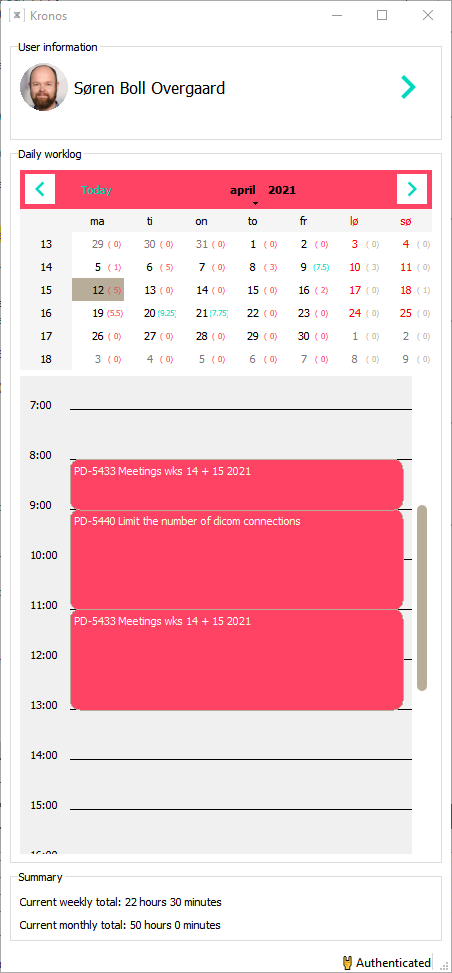

# Kronos
Kronos is a worklog tracker for Jira. It's a work in progress.

# Features
- Native application for Linux, MacOS and Windows. No silly web interfaces.
- Jira integration
- Visual representation of worklogs
- Keeps track of recently used Jira issues
- Happy color scheme to brighten your day

# Screenshot

# Build status

# Todos
- Disallow overlapping worklogs
- Prefer jira issues assigned to current user in search result
- Prefer jira issues in current sprint in search result
- "Working" overlay on DailyRegistrations
- Double clicking an issue should accept the registration dialog
- Typing "Enter" should perform search immediately in registration dialog
- Annoying tray icon which nags about logging work
- Increased test coverage
- Inline documentation
- Optional: Collapse authentication widgets
- Optional: Persist window size and location across restarts
- Optional: Keyboard shortcuts
- Optional: Resize worklogs
- Optional: Rebrand registrations as worklogs
